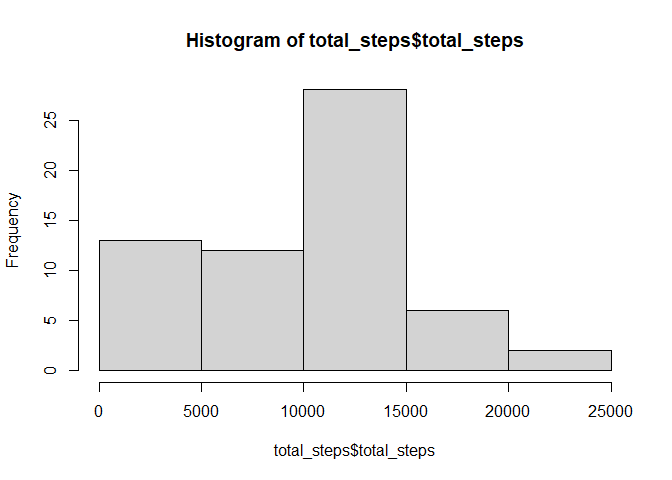
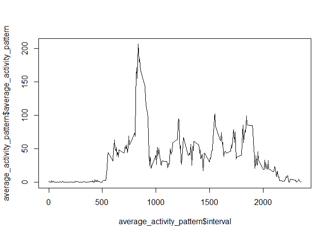
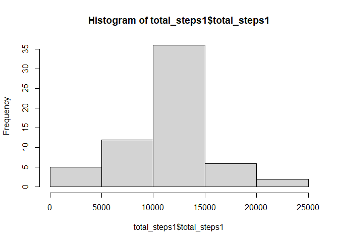
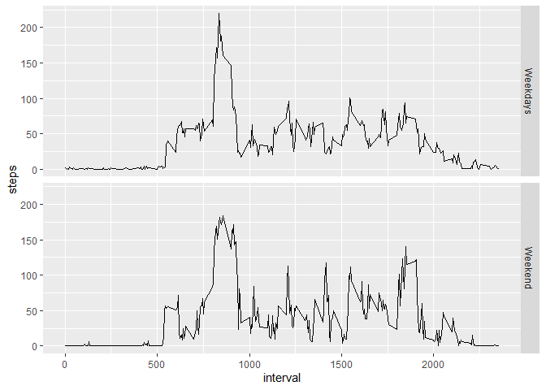

## Loading and preprocessing the data

Reading the data from CSV.


```r
  activityData <- read.csv("activity.csv")
  print(head(activityData))
```

```
##   steps       date interval
## 1    NA 01-10-2012        0
## 2    NA 01-10-2012        5
## 3    NA 01-10-2012       10
## 4    NA 01-10-2012       15
## 5    NA 01-10-2012       20
## 6    NA 01-10-2012       25
```


## What is mean total number of steps taken per day?

Using dplyr package to group by date and calculating the sum,mean and median per day


```r
  library(dplyr)
```

```
## 
## Attaching package: 'dplyr'
```

```
## The following objects are masked from 'package:stats':
## 
##     filter, lag
```

```
## The following objects are masked from 'package:base':
## 
##     intersect, setdiff, setequal, union
```

```r
  total_steps <- activityData %>% group_by(date) %>% summarise(total_steps = sum(steps, na.rm = TRUE))
  print(head(total_steps))
```

```
## # A tibble: 6 x 2
##   date       total_steps
##   <chr>            <int>
## 1 01-10-2012           0
## 2 01-11-2012           0
## 3 02-10-2012         126
## 4 02-11-2012       10600
## 5 03-10-2012       11352
## 6 03-11-2012       10571
```

```r
  mean_per_day <- activityData %>% group_by(date) %>% summarise(mean_per_day = mean(steps, na.rm = TRUE))
  print(head(mean_per_day))
```

```
## # A tibble: 6 x 2
##   date       mean_per_day
##   <chr>             <dbl>
## 1 01-10-2012      NaN    
## 2 01-11-2012      NaN    
## 3 02-10-2012        0.438
## 4 02-11-2012       36.8  
## 5 03-10-2012       39.4  
## 6 03-11-2012       36.7
```

```r
  median_per_day <- activityData %>% group_by(date) %>% summarise(median_per_day = median(steps, na.rm = TRUE))
  print(head(median_per_day))
```

```
## # A tibble: 6 x 2
##   date       median_per_day
##   <chr>               <dbl>
## 1 01-10-2012             NA
## 2 01-11-2012             NA
## 3 02-10-2012              0
## 4 02-11-2012              0
## 5 03-10-2012              0
## 6 03-11-2012              0
```

### Plot of the total Steps


```r
  hist(total_steps$total_steps)
```

<!-- -->

## What is the average daily activity pattern?

Calculating the average daily activity pattern for all days


```r
  average_activity_pattern <- activityData %>% group_by(interval) %>% summarise(average_activity_pattern = mean(steps, na.rm = TRUE))

  print(head(average_activity_pattern))
```

```
## # A tibble: 6 x 2
##   interval average_activity_pattern
##      <int>                    <dbl>
## 1        0                   1.72  
## 2        5                   0.340 
## 3       10                   0.132 
## 4       15                   0.151 
## 5       20                   0.0755
## 6       25                   2.09
```

### Plot for average activity pattern


```r
  plot(type = 'l', x = average_activity_pattern$interval, y = average_activity_pattern$average_activity_pattern) 
```

<!-- -->

### Calculating the max of average activity


```r
  maximumaverage_activity_pattern <- max(average_activity_pattern$average_activity_pattern)
  intervalMax <- average_activity_pattern[which(average_activity_pattern$average_activity_pattern == maximumaverage_activity_pattern), 1]  
```

The maximum average activity is 206.1698113 at the interval 835.

## Imputing missing values

### Total number of missing values


```r
  totalNAs <- sum(is.na(activityData))
```

The total number of missing values are 2304

### Streatgy for filling missing values

For each day I will filling missing values by average of the interval. 

### Filling the missing values


```r
  activityDataNew1 <- activityData
  for(i in average_activity_pattern$interval){
    activityDataNew1[activityDataNew1$interval == i & is.na(activityDataNew1$steps),]$steps = average_activity_pattern$average_activity_pattern[average_activity_pattern$interval == i]
  }

  print(head(activityDataNew1))   
```

```
##       steps       date interval
## 1 1.7169811 01-10-2012        0
## 2 0.3396226 01-10-2012        5
## 3 0.1320755 01-10-2012       10
## 4 0.1509434 01-10-2012       15
## 5 0.0754717 01-10-2012       20
## 6 2.0943396 01-10-2012       25
```

### Plot of the missing values


```r
  total_steps1 <- activityDataNew1 %>% group_by(as.Date(date)) %>% summarise(total_steps1 = sum(steps, na.rm = TRUE))
  hist(total_steps1$total_steps1)
```

<!-- -->

### Analysis of change of mean and median


```r
  mean_per_day <- activityDataNew1 %>% group_by(date) %>% summarise(mean_per_day = mean(steps, na.rm = TRUE))
  print(head(mean_per_day))
```

```
## # A tibble: 6 x 2
##   date       mean_per_day
##   <chr>             <dbl>
## 1 01-10-2012       37.4  
## 2 01-11-2012       37.4  
## 3 02-10-2012        0.438
## 4 02-11-2012       36.8  
## 5 03-10-2012       39.4  
## 6 03-11-2012       36.7
```

```r
  median_per_day <- activityDataNew1 %>% group_by(date) %>% summarise(median_per_day = median(steps, na.rm = TRUE))
  print(head(median_per_day))
```

```
## # A tibble: 6 x 2
##   date       median_per_day
##   <chr>               <dbl>
## 1 01-10-2012           34.1
## 2 01-11-2012           34.1
## 3 02-10-2012            0  
## 4 02-11-2012            0  
## 5 03-10-2012            0  
## 6 03-11-2012            0
```

As we can see from above plot and table, the mean and median have either been increased and some for some they have been decreased.


## Are there differences in activity patterns between weekdays and weekends?


```r
  library(ggplot2)

    
    mean_per_day1 <- cbind(activityData, day = 'test')
  
    mean_per_day1[weekdays(as.Date(mean_per_day1$date)) == 'Sunday' | weekdays(as.Date(mean_per_day1$date)) == 'Saturday', 4] <- 'Weekend'
  
  mean_per_day1[!(weekdays(as.Date(mean_per_day1$date)) == 'Sunday' | weekdays(as.Date(mean_per_day1$date)) == 'Saturday'), 4] <- 'Weekdays'
  
  
  mean_per_day1 <- aggregate(steps~interval + day, mean_per_day1,mean)
  
  head(mean_per_day1)
```

```
##   interval      day     steps
## 1        0 Weekdays 2.3947368
## 2        5 Weekdays 0.4736842
## 3       10 Weekdays 0.1842105
## 4       15 Weekdays 0.2105263
## 5       20 Weekdays 0.1052632
## 6       25 Weekdays 2.6315789
```

```r
  ggplot(data = mean_per_day1) + geom_line(mapping = aes(x = interval, y = steps)) + facet_grid(day~.)
```

<!-- -->
